# DEPLOYMENT  

The project has been successfully deployed using Netlify. You can access the production version of the website by following this link: [http://catwalrus.site](http://catwalrus.site) 

or this free site link: [https://ornate-banoffee-39e0b4.netlify.app](https://ornate-banoffee-39e0b4.netlify.app).

## Netlify Sign up process & connect Netlify to your Github project

1. Sign Up or Login to Netlify

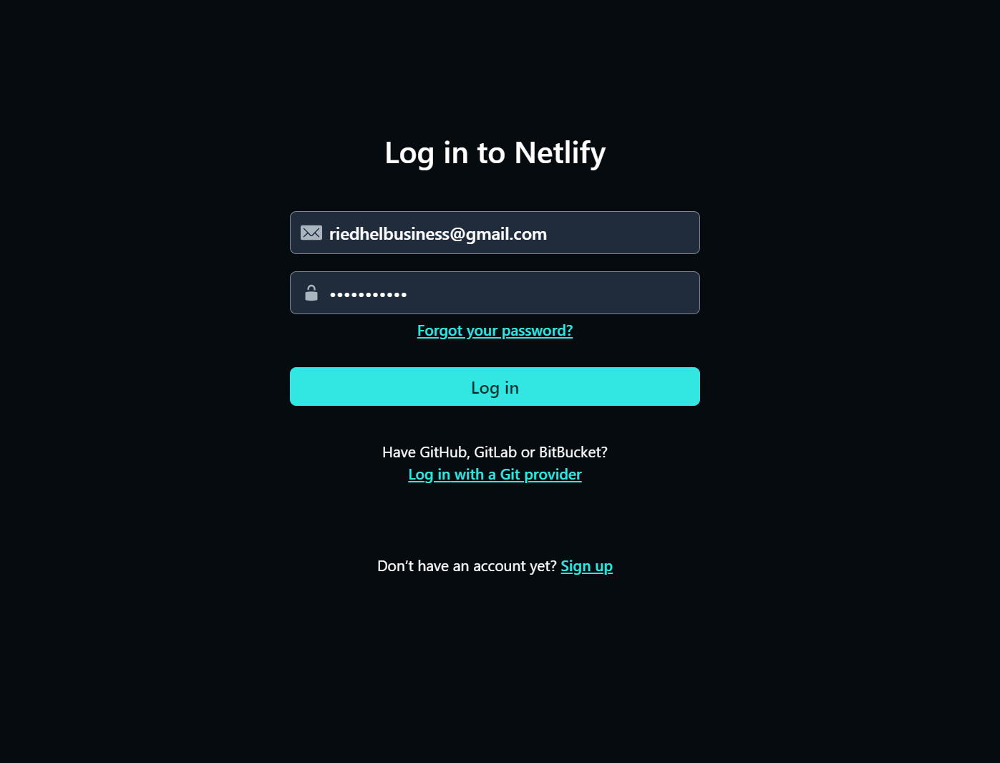

2. Add New Site

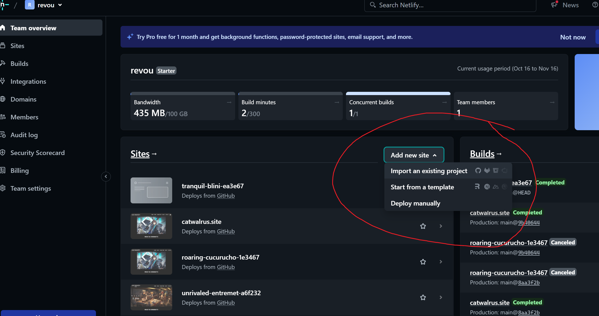

3. Deploy With Github

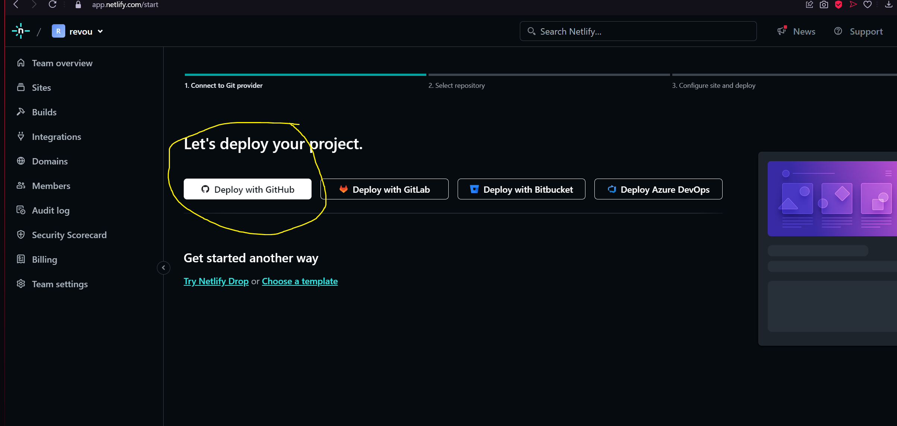

4. Find Repository From Github 

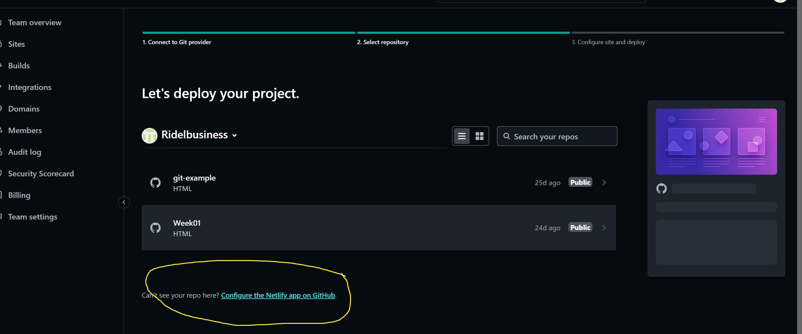

5. Update Netlify's Repository Access

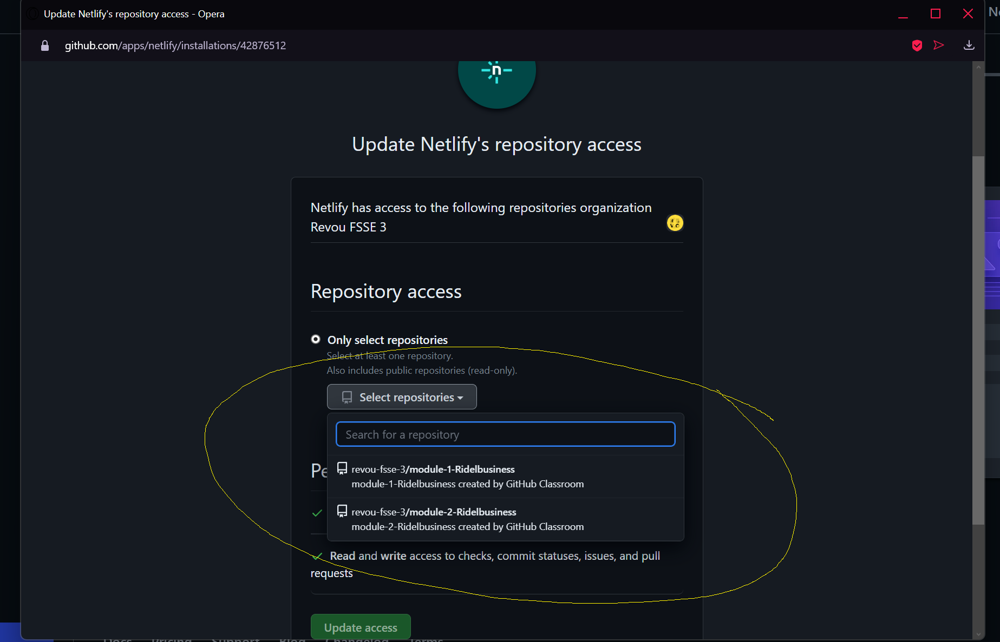

6. Select Again The Repository 

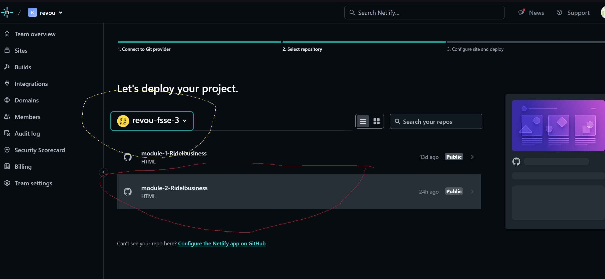

7. Deploy The Project and Set The Base Directory

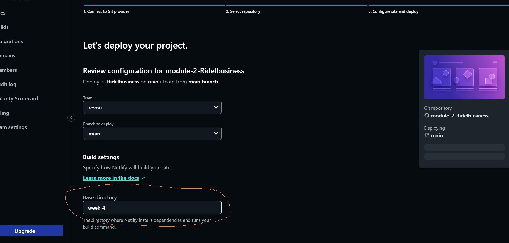

8. Site Has Been Deployed and Have Free Site Name

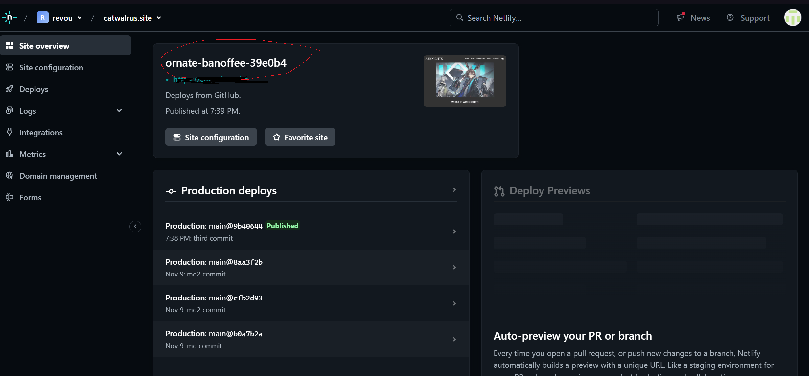

## How to connect your custom domain and DNS

1. Log in or Sign Up to NiagaHoster

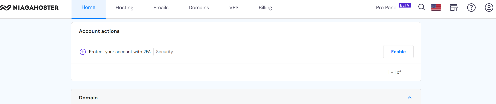

2. Buy The Domain

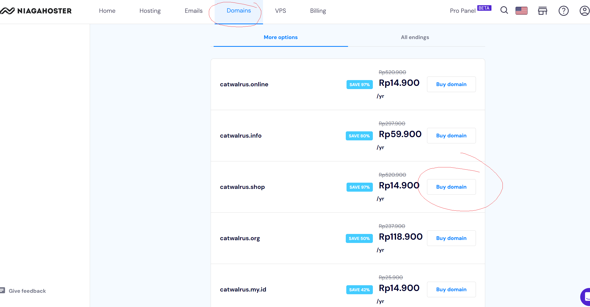

3. Choose And Manage The Domain 

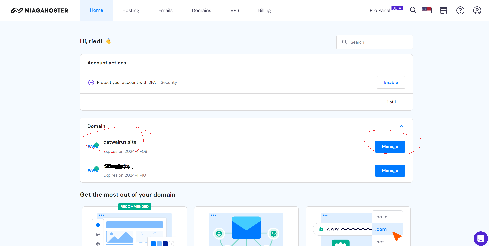

4. Find DNS in Netlify Domain Management

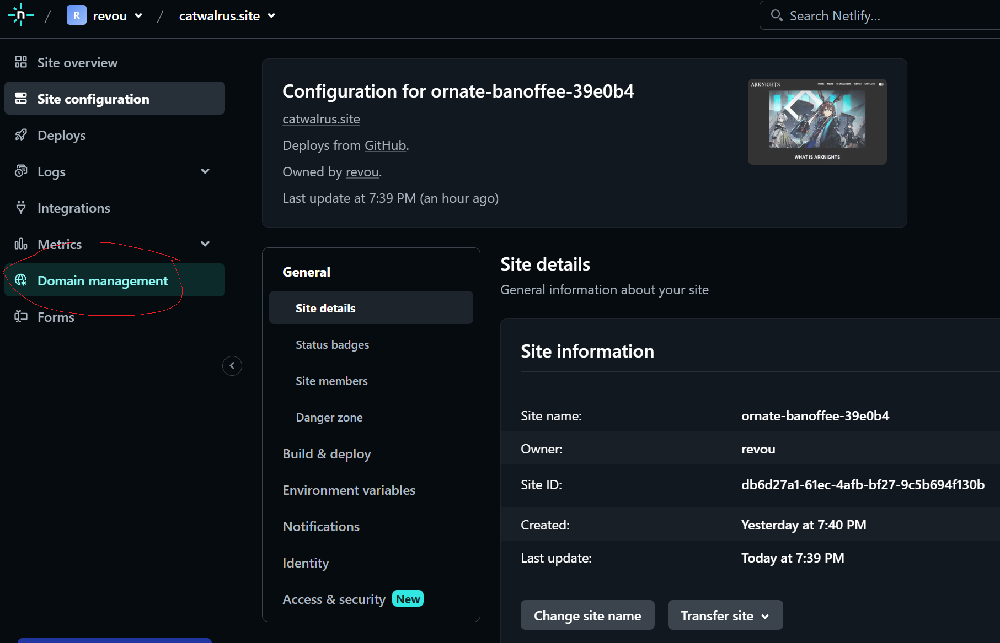

5. Find Nameserver in Netlify and Copied

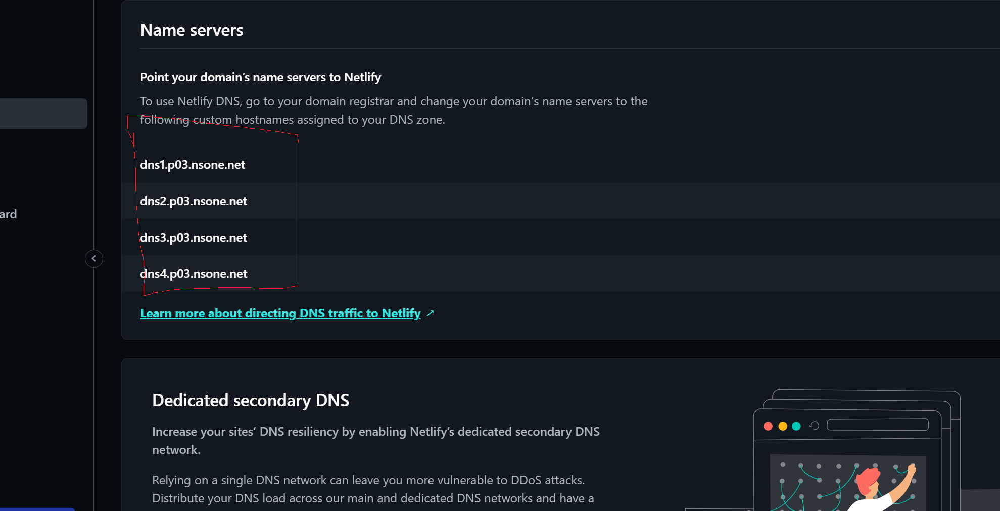

6. Change Nameserver in Niagahoster Domain and Pasted

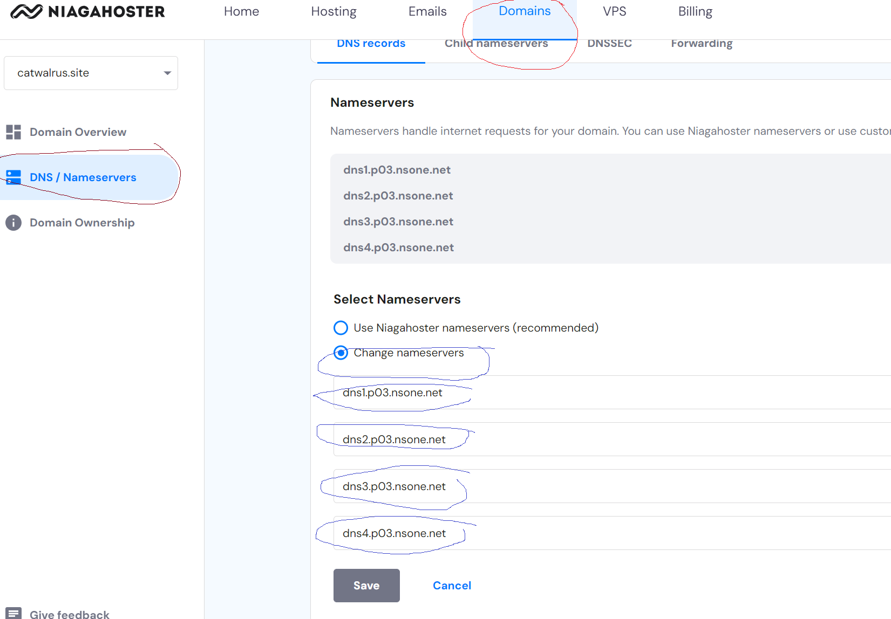

7. Wait For Domain Propagation 

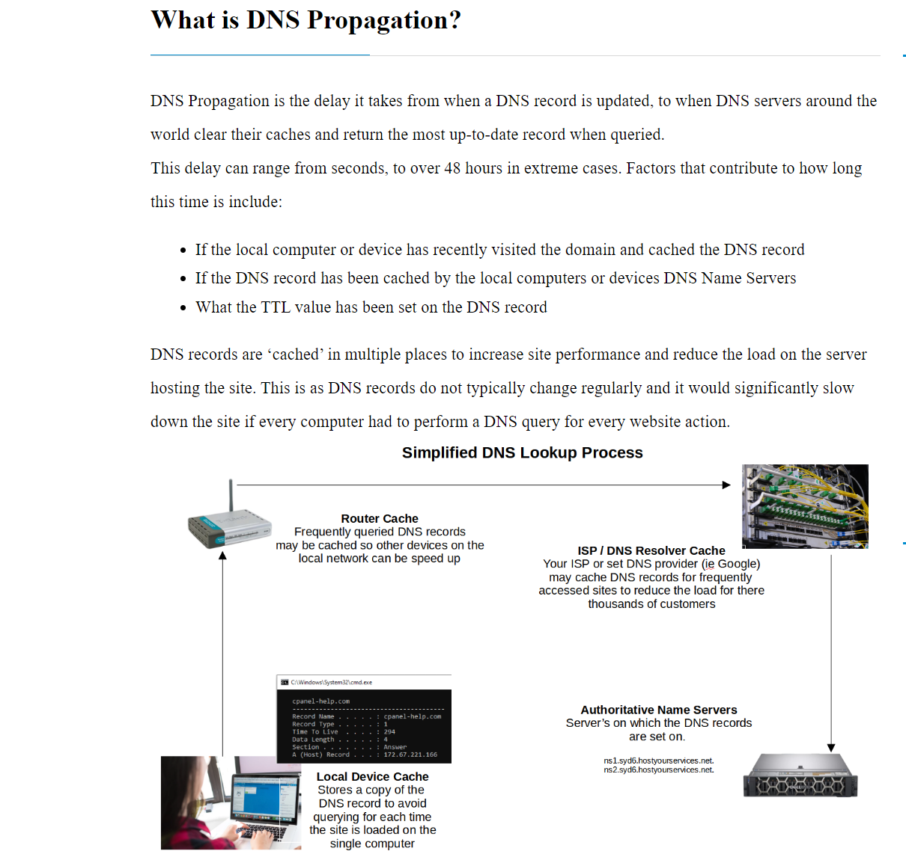

8. Domain Has Been Connected Between Niagahoster and Netlify

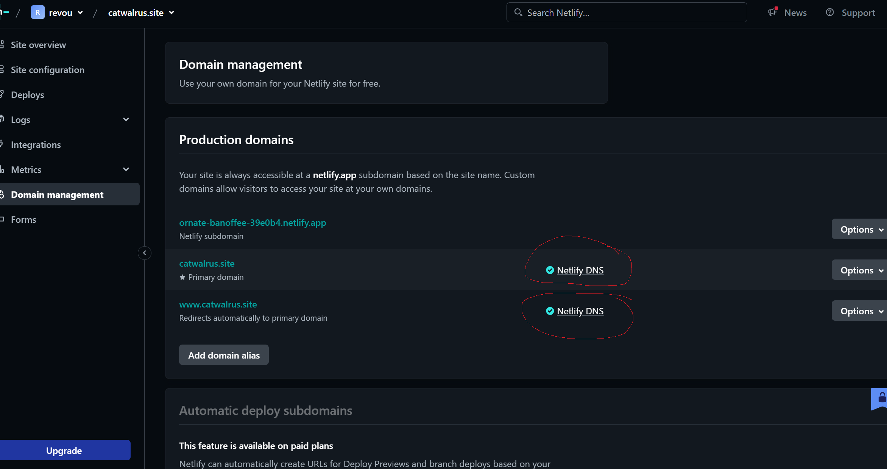

    DNS Record

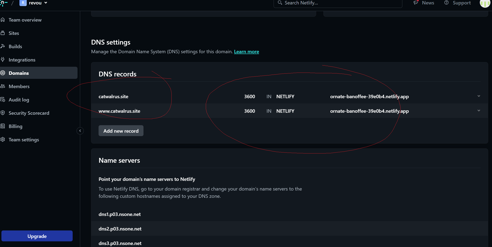

